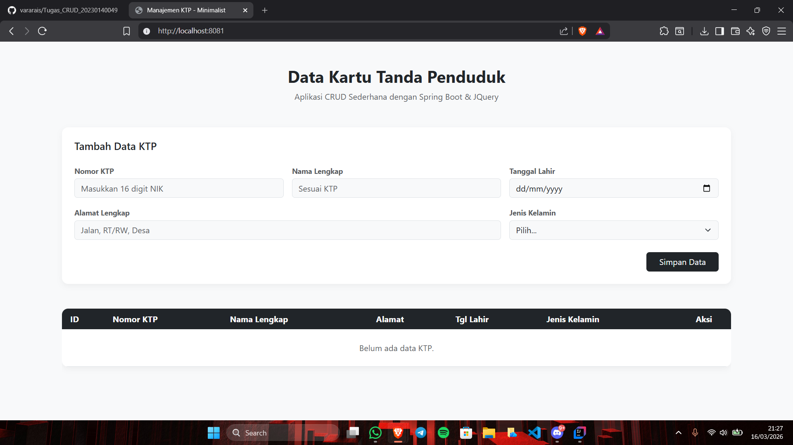
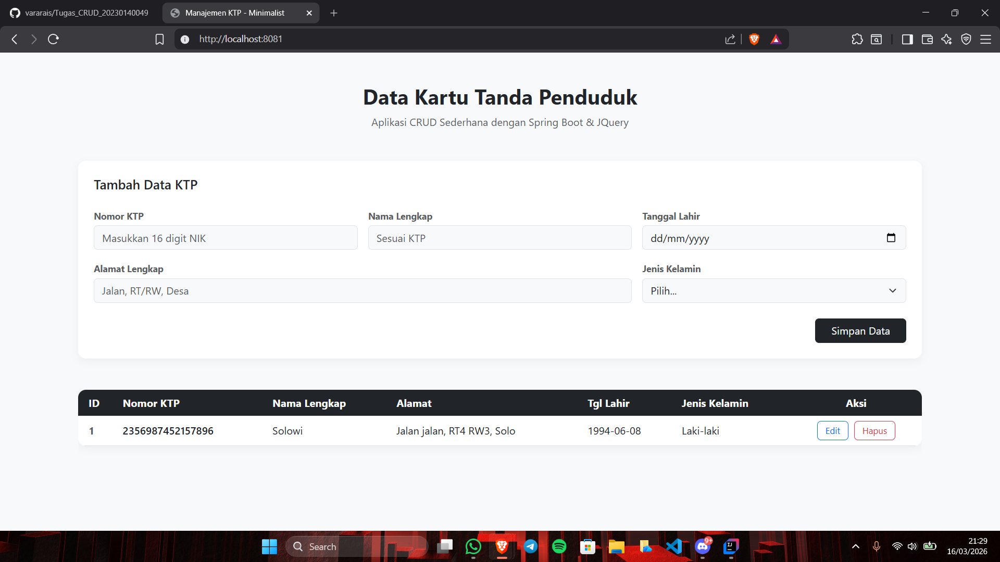
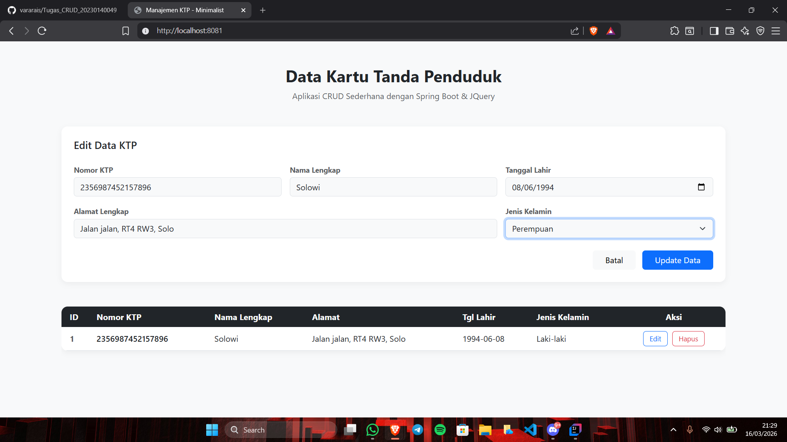
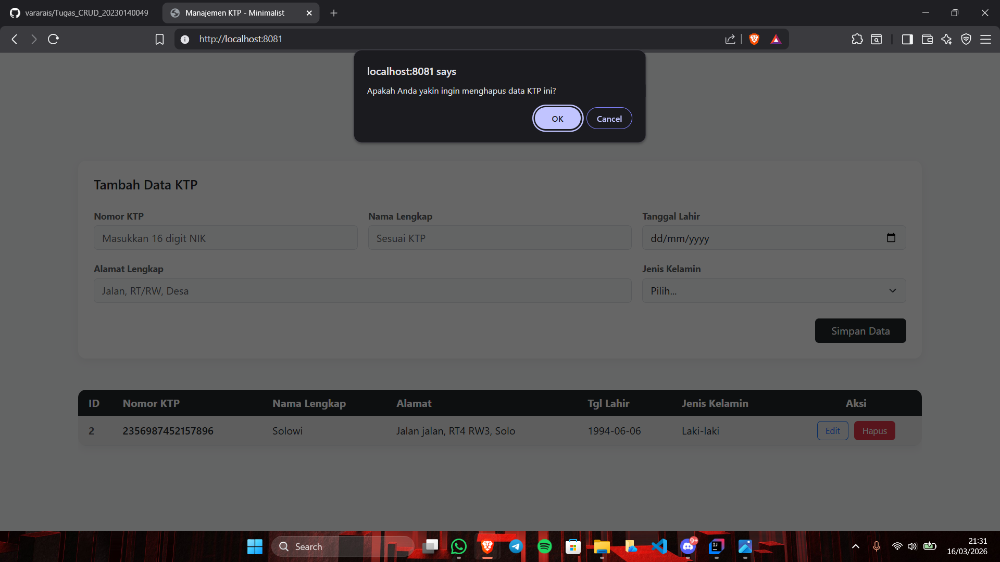
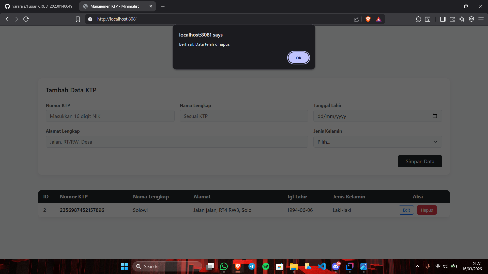

# Tugas CRUD KTP - Muhammad Anan (20230140049)

Proyek ini adalah tugas praktikum untuk membangun sistem manajemen data KTP menggunakan arsitektur Client-Server (Spring Boot & AJAX JQuery).

## Tech Stack
* **Backend**: Java 25, Spring Boot 4.0.3, Spring Data JPA, MySQL.
* **Frontend**: HTML5, CSS3, Bootstrap 5, JQuery (Ajax).
* **Database**: MySQL (Schema: `ktp_database`).

---

## API Documentation

Base URL: `http://localhost:8081`

### 1. Create Data (Tambah KTP)
* **URL**: `/ktp`
* **Method**: `POST`
* **Body**:
```json
{
  "nomorKtp": "3372010101010001",
  "namaLengkap": "Muhammad Anan",
  "alamat": "Palagan, Sleman",
  "tanggalLahir": "2005-01-01",
  "jenisKelamin": "Laki-laki"
}
```

### 2. Get Data (List KTP semua)
* **URL**: `/ktp`
* **Method**: `GET`
```json
{
  "status": "success",
  "data": [
    {
      "id": 1,
      "nomorKtp": "3372010101010001",
      "namaLengkap": "Muhammad Anan",
      "alamat": "Palagan, Sleman",
      "tanggalLahir": "2005-01-01",
      "jenis_kelamin": "Laki-laki"
    },
    {
      "id": 2,
      "nomorKtp": "3372010101010002",
      "namaLengkap": "Budi Santoso",
      "alamat": "Kasihan, Bantul",
      "tanggalLahir": "2004-05-12",
      "jenis_kelamin": "Laki-laki"
    }
  ]
}
```
* **GET by ID (Spesifik)**
```json
{
  "status": "success",
  "data": {
    "id": 1,
    "nomorKtp": "3372010101010001",
    "namaLengkap": "Muhammad Anan",
    "alamat": "Palagan, Sleman",
    "tanggalLahir": "2005-01-01",
    "jenis_kelamin": "Laki-laki"
  }
}
```

### 3. Update Data (Perbarui data KTP)
* **URL**: `/ktp/{id}`
* **Method**: `PUT`
* **Path Variable**: `id(integer)`
```json
{
  "nomorKtp": "4856978541258963",
  "namaLengkap": "Muhammad Silki",
  "alamat": "Sinduadi, Sleman",
  "tanggalLahir": "2007-01-01",
  "jenisKelamin": "Laki-laki"
}
```

### 4. Delete Data (Menghapus data KTP)
* **URL**: `/ktp/{id}`
* **Method**: `DELETE`
* **Path Variable**: `id(integer)`
```json
{
  "status": "success delete ktp with id 1"
}
```

* **Note : Semua ini jika respon server adalah SUCCESS**

---

Foto FRONTEND

* **Awal** 


* **Post / Add Data**


* **Put / Update Data**



* **Delete / Hapus Data**



---

Cara run Project

* **Buat database ktp_database di MySql**
* **Atur Kredensial di file env**
* **Run App di dalam Praktikum2Application**
* **Buka Halaman pada http://localhost:8081 di browser**